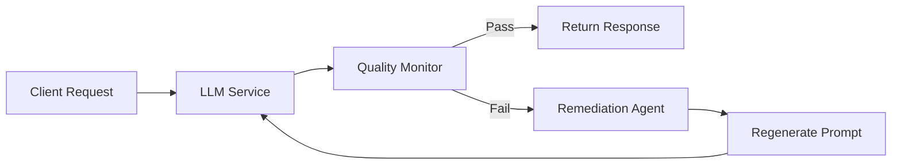

# Autonomous LLM Self-Healing Pipeline

```mermaid
flowchart LR

A[Client Request]
--> B[LLM Service]

B --> C[Quality Monitor]

C -->|Pass| D[Return Response]

C -->|Fail| E[Remediation Agent]

E --> F[Regenerate Prompt]

F --> B
```
